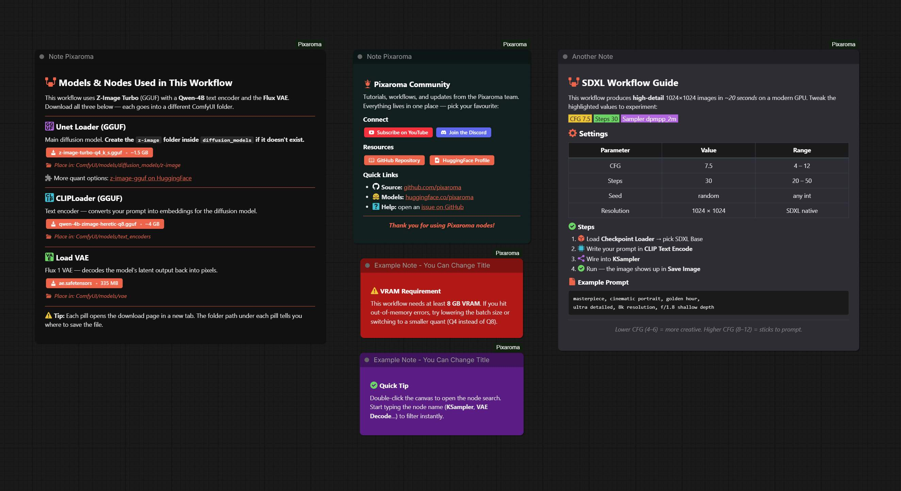
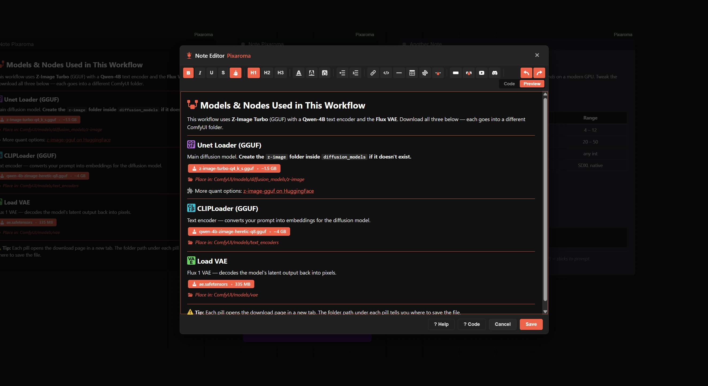
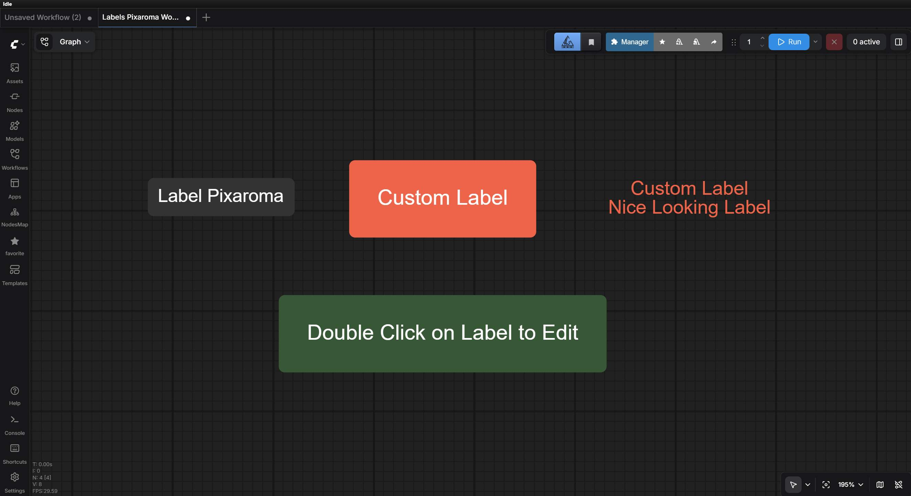
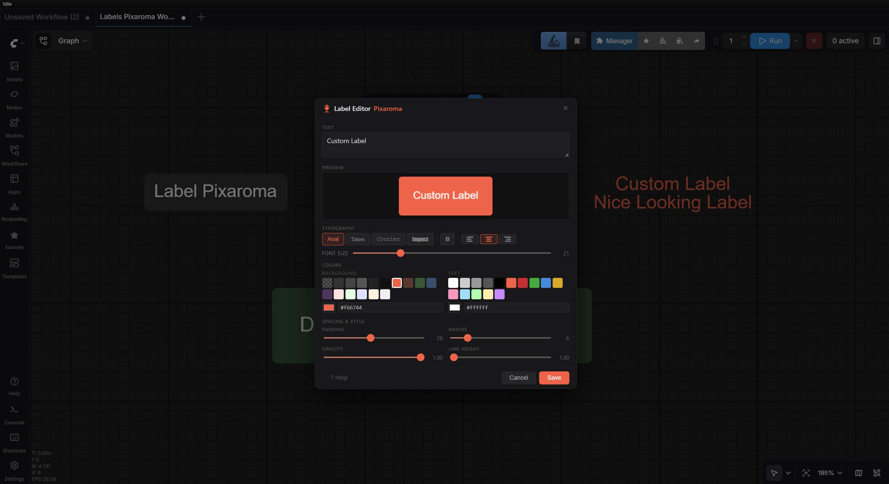

<div align="center">
  
  <h1>ComfyUI LinuxTechLab</h1>
  <p align="center">
    <strong>Elevate your ComfyUI workflow with professional-grade creative tools.</strong><br />
    3D scenes • Texture painting • Layered composition • Precision cropping • Rich notes • Side-by-side comparison
  </p>

  <p align="center">
    <a href="https://github.com/sebastianzehner/ComfyUI-LinuxTechLab/blob/main/LICENSE"></a>
    <a href="https://www.youtube.com/@LinuxTechLab"></a>
  </p>
</div>

---

## 🎨 Creative Suite

LinuxTechLab turns ComfyUI into a powerful, easy-to-use design space. It brings professional editing right into your workflow!

### 🧊 3D Builder
A full 3D scene editor right inside ComfyUI. Drop in shapes, trees, houses, furniture, or import your own 3D models. You get easy camera controls, realistic lighting, undo/redo, and live previews. Perfect for making reference scenes for ControlNet or depth maps!


### 🎚️ AudioReact
Audio-reactive image-to-video. **No extra models needed**, just an image and an audio track. Open the fullscreen editor, scrub the audio, and watch 15 motion modes (Pulse Zoom, Camera Shake, Glitch, Pinch, Wave, Tilt, Pixelate, RGB Split, and more) react to the beat in real time with a live WebGL preview. Stack 8 overlay effects on top: chroma shift, bloom, vignette, hue shift, cinematic teal/orange grade, letterbox, scanlines, and film grain. Pairs with **Save Mp4 LinuxTechLab** to write the clip directly to MP4 with audio muxed in. Requires WebGL2.

📥 [Download example workflow](workflows/AudioReact_Workflow.json)


### ✨ Image Composer
Easily combine and arrange multiple images. Move, scale, and rotate layers using a simple visual editor. Use the eraser to tweak things by hand, or let our AI background removal tool isolate objects for you instantly.


### 🖌️ Paint Studio
A fast, easy-to-use painting tool. It features layers, custom brushes, and a smudge tool for smooth blending. Perfect for fixing details, drawing custom masks, or painting from scratch.


### ✂️ Precision Crop
No more guessing crop sizes with numbers! Visually draw your crop box. It includes standard presets (like 1:1 or 16:9) so your image is always framed perfectly for social media or video.


### 📝 Note
A beautiful, simple text editor to document your workflows right on the canvas. Write normally using bold, italics, lists, and headings. Add custom colored buttons, icons, or links to YouTube and Discord. You can even color-code your notes to match your style. It perfectly saves and restores exactly how you styled it.



### 🏷️ Label
Keep your workflows tidy with clean, custom labels.




### 🎬 Save Mp4
Encode video frames + optional audio straight to MP4. Built-in `<video>` preview right on the node so you can watch the result without leaving ComfyUI. Pairs with AudioReact, but works with any source that produces frames + AUDIO.

### 🖼️ Preview Image
A handy way to preview your image right on the node, but better! It gives you two simple buttons: **Save to Disk** (choose any folder on your computer) and **Save to Output** (saves to your ComfyUI output folder). Both options safely embed your workflow into the image, so you can drag the image back in later to restore everything.

### 📐 Resolution
A simple, one-click resolution picker. Choose from standard aspect ratios (like 1:1, 16:9, or 9:16) and instantly get the exact width and height you need, including popular sizes for AI video. Or, use Custom mode to type in your exact dimensions. It perfectly saves all your settings with your workflow!

---

## 🚀 Getting Started

### 1. Installation

#### **Method A: ComfyUI Easy Install (Zero-Config)**
If you use [ComfyUI Easy Install](https://github.com/Tavris1/ComfyUI-Easy-Install) for Windows, **LinuxTechLab is already included!** Just update via the built-in updater and you're good to go.

#### **Method B: ComfyUI Manager**
1. Search for **LinuxTechLab** in the ComfyUI Manager.
2. Click **Install** and restart ComfyUI.

#### **Method C: Manual Installation**
```bash
cd ComfyUI/custom_nodes
git clone https://github.com/sebastianzehner/ComfyUI-LinuxTechLab.git
```

### 2. Optional: AI Background Removal
Want to use the **AI Remove Background** button in the Image Composer? Just install `rembg`:

```bash
# Windows Portable
python.exe -m pip install rembg

# Standard Installation
pip install rembg
```

Once installed, you can pick from different AI models depending on the quality you need:

| Option | Size | What it is |
|--------|------|------------|
| **Auto (recommended)** | — | Automatically picks the best available model for you. |
| **Fast** | ~176 MB | Works on any setup, great for quick cutouts. |
| **Balanced** | ~170 MB | Cleaner edges. |
| **Best** | ~900 MB | Highest quality cutouts. |

---

## 🛠 Changelog

### **May 05, 2026**
- **Image Composer — per-layer blur:** Non-destructive Gaussian blur slider in the Transform Properties panel. Drag to focus or defocus any layer; the slider uses a quadratic curve so the lower half gives fine control over subtle blur amounts. Saves with the workflow, restores cleanly, and bakes into both the editor preview AND the final Python output. Each layer keeps its own blur — switch layers and the slider snaps to that layer's value.
- **Image Composer — Shift+Scroll wheel scales the selected layer:** ±5% per tick. Wheel without Shift still zooms the canvas as before.
- **Image Composer — placeholder quality fix:** High-resolution upstream images (2K+) used to be permanently downsampled to the placeholder's slot size (~512×512) — now preserved at their full source resolution, with the visual layout unchanged. Old workflows benefit on next reload.
- **Image Composer — placeholder ratio change preserves preview:** Switching a placeholder's ratio dropdown no longer drops back to the blank slot; the upstream image preview re-renders into the new ratio automatically.
- **Image Composer — selection-box fixes:** Bounding box no longer drifts a couple of pixels off the image at the edges, no longer disappears off-screen when you drag a heavily-scaled layer past the canvas, and undo (Ctrl+Z) now works while a slider has focus.

### **May 04, 2026**
- **Preview Image Pixaroma — major upgrade:** Batches now render as a **horizontal thumbnail strip** with `i / N` counters; click any thumbnail to open that frame inline at full size. **Arrow keys** ← → navigate, click the image to advance, `Esc` or the orange-on-hover **×** collapses back. Save buttons act on the **selected frame**. New **save_mode** widget (preview / save) — flip to `save` and the node auto-saves every batch frame to `output/` with workflow metadata embedded, becoming a drop-in for SaveImage. `filename_prefix` now supports subfolder syntax (`SDXL/portrait` → `output/SDXL/portrait_00001_.png`). Save-to-Disk auto-increments suggested filename per click. Previews **survive workflow tab switching** — pick a frame, jump to another tab, come back, your selection is still there.
- **Resolution Pixaroma upgrades:** Added 4:3, 3:4, and 4:5 aspect ratios (4:5 with Instagram-portrait-friendly sizes like 1152×1440). New **Custom Ratio** mode lets you type any W:H you want — quick-pick width chips set Width and auto-compute Height from your ratio. Math expressions now work in the Width and Height fields (e.g. `1024+128`, `512*2`, `(1024+128)/2`). Up/Down arrow keys step by snap.

### **April 27, 2026**
- **NEW: AudioReact LinuxTechLab**: turn an image into an audio-reactive video with a fullscreen WebGL editor. 15 motion modes, 8 stackable overlays, real-time scrubbable preview.
- **NEW: Save Mp4 LinuxTechLab**: encode frames + audio straight to MP4, with an in-node video preview.

### **April 25, 2026**
- **Smoother 3D Builder:** Moving the camera, spinning, and zooming in your 3D scenes is now much faster and less laggy!

### **April 23, 2026**
- **New Preview Node:** Added Preview Image LinuxTechLab with simple buttons to save your image anywhere on your computer.
- **Organized Menu:** All our nodes now live under a single `LinuxTechLab` menu.

### **April 22, 2026**
- **New Resolution Node:** A simple, one-click resolution picker for your aspect ratios.
- **New Note Node:** A beautiful rich-text editor for adding notes directly to your canvas. [Watch the tutorial](https://www.youtube.com/watch?v=XCgmEodQlIU).

### **April 19, 2026**
- **Clearer Close Buttons:** Pop-up editors now have an obvious red "Close" button.
- **Offline 3D Builder:** The 3D Builder no longer needs an internet connection to start.
- **Paint Fixes:** Fixed the brush cursor disappearing, and added a new "Remove Background" AI button.
- **Composer Fixes:** Layer blend modes (like Multiply or Screen) now save and load correctly.
- **3D Shortcuts:** Added Blender-style keyboard shortcuts (G to move, Shift+D to duplicate, etc.).

### **April 15, 2026**
- **Huge 3D Builder Update:** Added 18 basic shapes, 16 complex objects (trees, furniture), 5 hollow vessels, and custom 3D model imports. Added camera views, a drop-to-floor button, and instant undo/redo. [Watch the tutorial](https://www.youtube.com/watch?v=DnKM-Np0fFw).

### **April 14, 2026**
- **Transparent Saves:** Added a checkbox to save images with transparent backgrounds in Paint, Composer, and 3D Builder.

### **April 13, 2026**
- **Paint Improvements:** Better cursors, smoother color picking, and quick brush resizing.
- **Settings:** LinuxTechLab now has its own section in the ComfyUI settings menu.

### **April 02, 2026**
- **ComfyUI 2.0 Compatibility:** Updated all nodes to run smoothly on the latest ComfyUI version.

### **April 01, 2026**
- **Launch Day:** Initial release of the LinuxTechLab suite! [Watch the video](https://www.youtube.com/watch?v=Lmxf8pK-H1k).

---

## 📜 Feedback & License

> [!NOTE]
> This suite was developed with significant AI assistance. While thoroughly tested, we welcome bug reports and feedback from the community!

⚖️ **Licensed under [MIT](https://github.com/sebastianzehner/ComfyUI-LinuxTechLab/blob/main/LICENSE)**

