<div align="center">
  
  <h1 align="center">ComfyUI LinuxTechLab</h1>
  <p align="center">
    <strong style="font-size: 1.2em;">Native-first, design-driven creative tools for the modern ComfyUI workflow.</strong><br />
    Built by enthusiasts, for enthusiasts. Optimized for precision, aesthetics, and deep integration.
  </p>
  <p align="center">
    <a href="https://github.com/sebastianzehner/ComfyUI-LinuxTechLab/blob/main/LICENSE">
      
    </a>
    &nbsp;
    <a href="https://www.youtube.com/@LinuxTechLab">
      
    </a>
  </p>
</div>

## 🐧 The LinuxTechLab Way

Our approach is simple: **Native-first.** If ComfyUI provides the functionality,
we use it. We only develop custom nodes when a feature is missing or when we can
elevate the user experience through our own design standards.

We are enthusiasts of Linux, AI, and the terminal. For us, this project is a
continuous journey of learning—diving deep into Python, JavaScript (Vue.js), and
the inner workings of ComfyUI. Our aesthetic is guided by the **Catppuccin
Mocha** theme, ensuring a beautiful and cohesive look across our entire Arch
Linux ecosystem.

We build with precision, staying close to the command line and working with
local AI and the **Pi Agent** to push the boundaries of what's possible in a
node-based environment.

## Creative Suite

LinuxTechLab turns ComfyUI into a powerful, intuitive design space.

### Crop Video

Crop a video to a specific aspect ratio or custom resolution using FFmpeg.
Includes a live video preview with a draggable crop overlay, a timeline
scrubber, and IN/OUT trim controls.

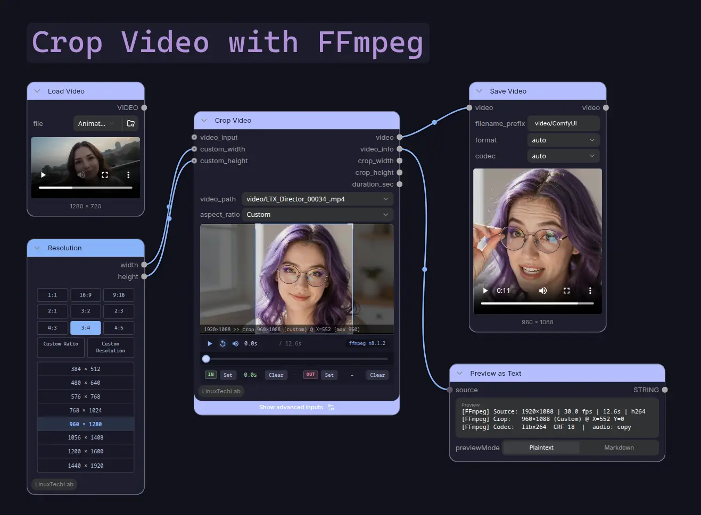

### 3D Builder

A full 3D scene editor right inside ComfyUI. Drop in shapes, trees, houses, furniture, or import your own 3D models. You get easy camera controls, realistic lighting, undo/redo, and live previews. Perfect for making reference scenes for ControlNet or depth maps!
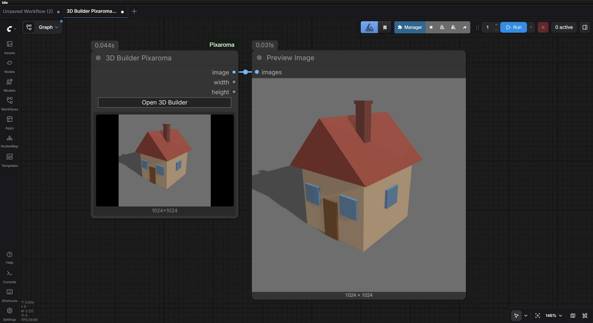
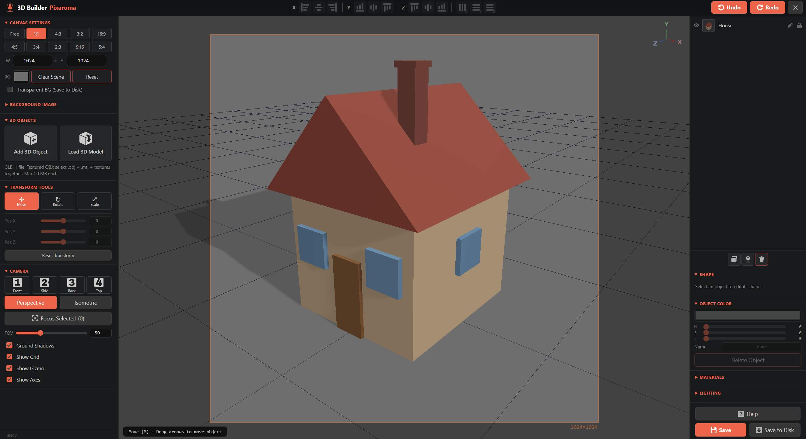

### AudioReact

Audio-reactive image-to-video. **No extra models needed**, just an image and an audio track. Open the fullscreen editor, scrub the audio, and watch 15 motion modes react to the beat in real time with a live WebGL preview. Pairs with **Save Mp4 LinuxTechLab** to write the clip directly to MP4 with audio muxed in.
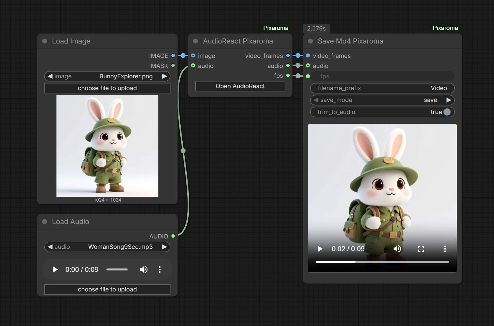
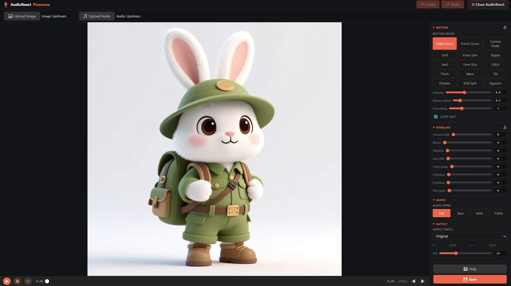
📥 [Download example workflow](workflows/AudioReact_Workflow.json)

### Image Composer

Easily combine and arrange multiple images. Move, scale, and rotate layers using a simple visual editor. Use the eraser to tweak things by hand, or let our AI background removal tool isolate objects for you instantly.
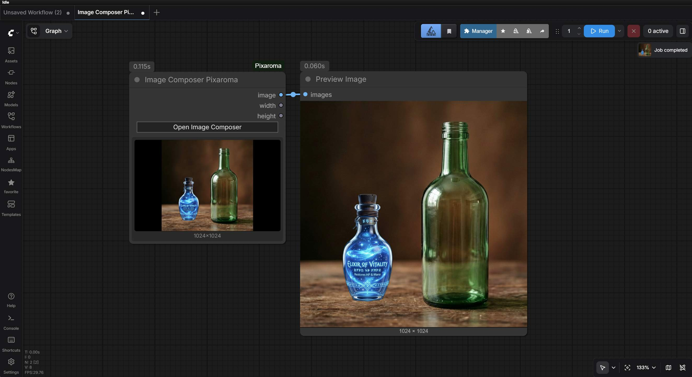
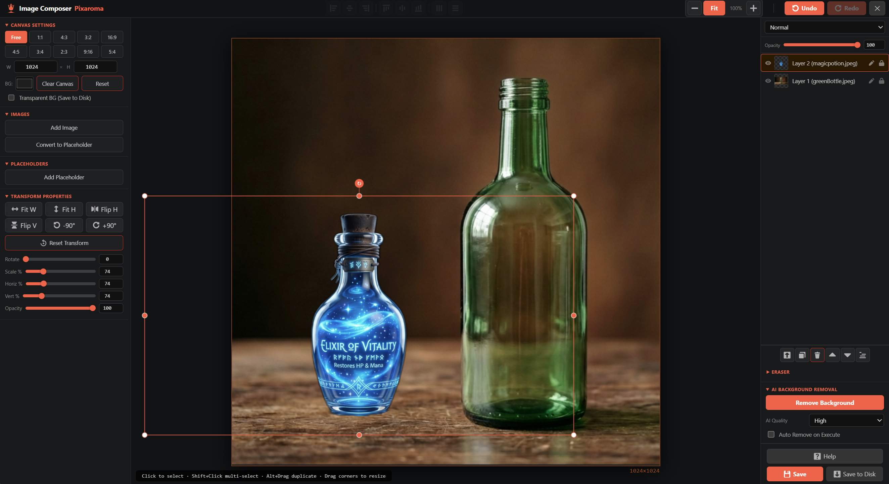

### Paint Studio

A fast, easy-to-use painting tool. It features layers, custom brushes, and a smudge tool for smooth blending. Perfect for fixing details, drawing custom masks, or painting from scratch.
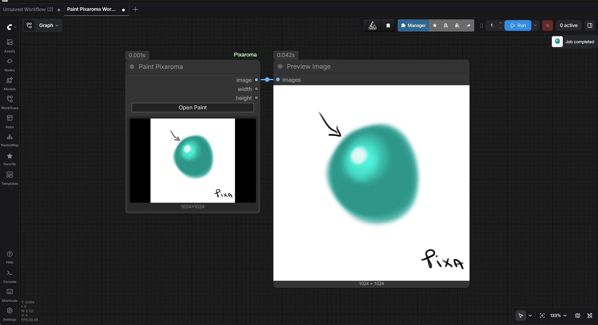
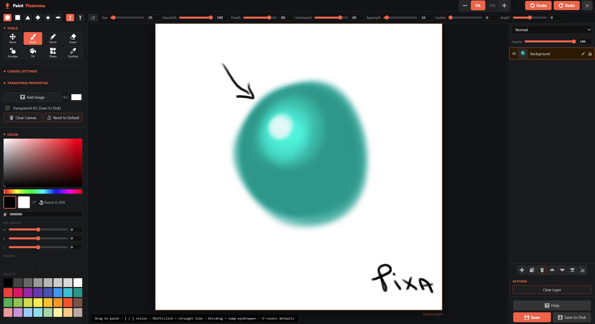

### Precision Crop

No more guessing crop sizes with numbers! Visually draw your crop box. It includes standard presets (like 1:1 or 16:9) so your image is always framed perfectly for social media or video.
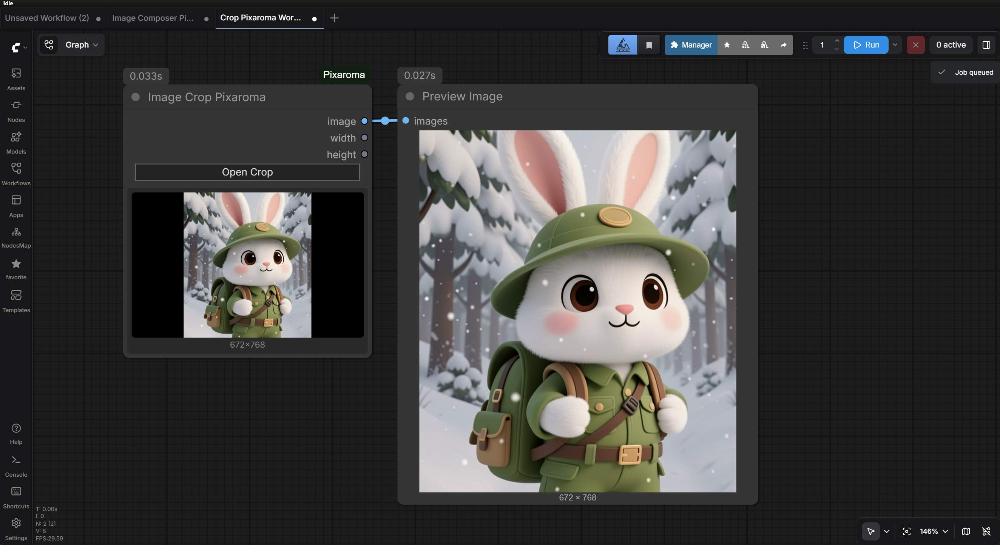
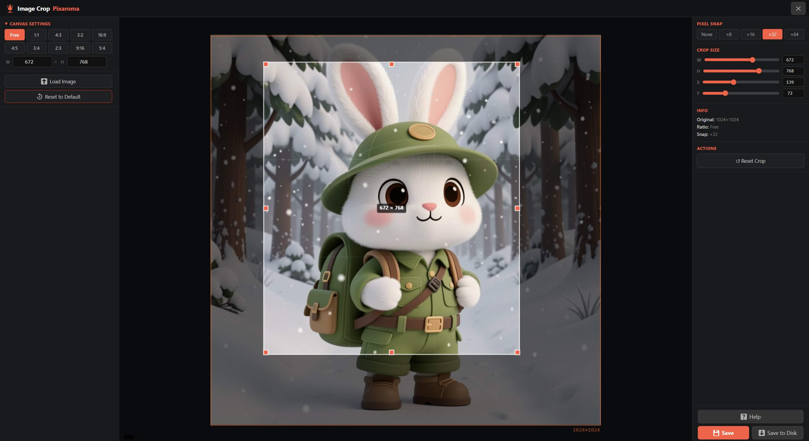

### Note

A rich-text annotation tool to leave detailed, visually engaging notes directly
on your ComfyUI canvas.

The Note node goes far beyond simple text. It allows you to create structured,
informative, and well-formatted content to document your workflows, provide
instructions, or include quick access to external resources.

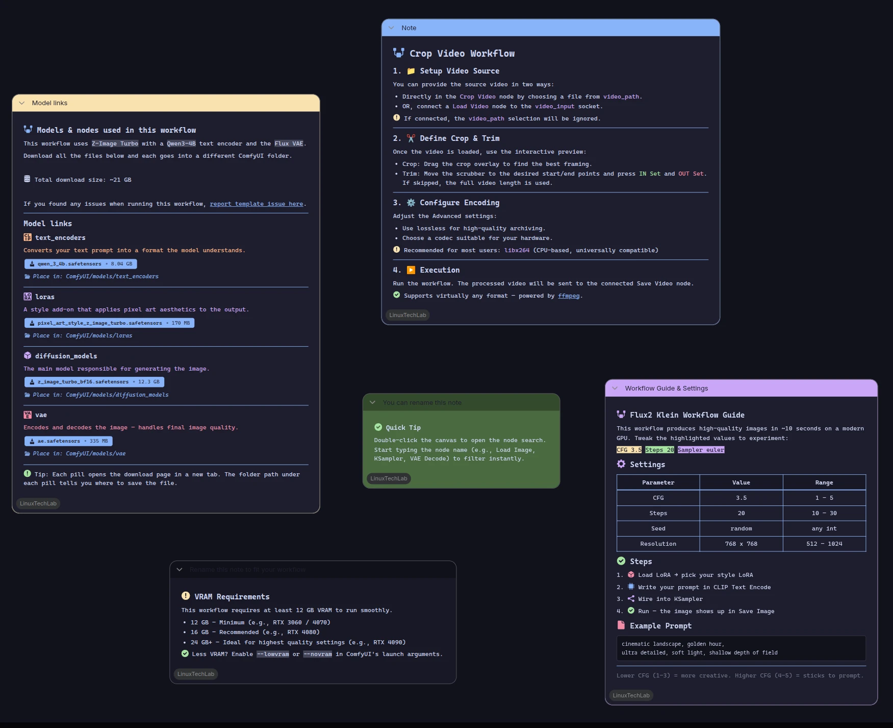

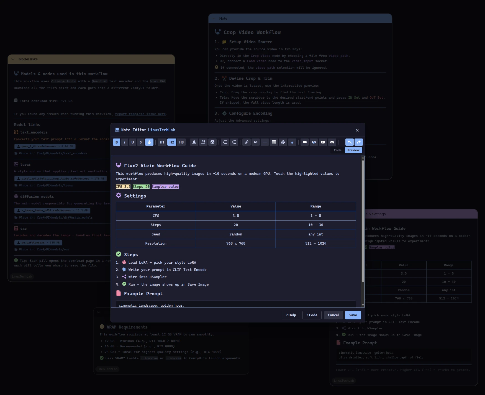

### Label

A visual design element used to add annotations and labels directly to the
ComfyUI canvas.

The Label node allows you to create beautiful, customizable text labels to
organize your workflows, highlight specific sections, or add descriptive notes.
It is a purely aesthetic node and does not affect the processing of images or
latent data.

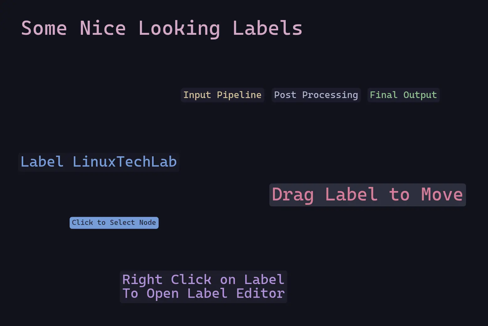

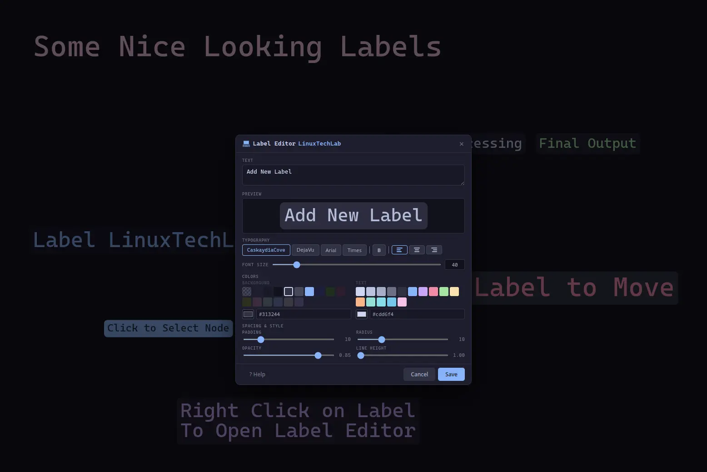

### Save Mp4

Encode video frames + optional audio straight to MP4. Built-in `<video>` preview right on the node so you can watch the result without leaving ComfyUI.

### Preview Image

An enhanced preview tool. It gives you two simple buttons: **Save to Disk** (choose any folder on your computer) and **Save to Output** (saves to your ComfyUI output folder). Both options safely embed the workflow into the image.

### Resolution

A simple, one-click resolution picker. Choose from standard aspect ratios (like 1:1, 16:9, or 9:16) and instantly get the exact width and height you need. Includes a **Custom mode** for precise control.

### Math Operator

A lightweight utility node for performing basic arithmetic (Addition, Subtraction, Multiplication, Division) directly within your node graph.

### Seed Generator

Take full control over your seeds. Switch between random, incremental, or manual modes, and use the built-in history to reuse seeds from previous runs. Perfect for systematic exploration or locking in a favorite seed.
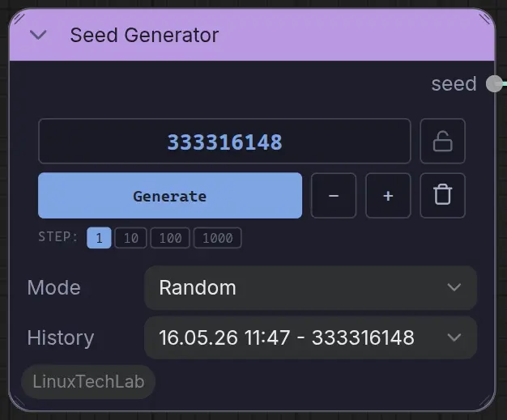

---

## 🚀 Getting Started

### 1. Installation

#### **Method A: ComfyUI Easy Install (Zero-Config)**

If you use [ComfyUI Easy Install](https://github.com/Tavris1/ComfyUI-Easy-Install) for Windows, **LinuxTechLab is already included!** Just update via the built-in updater and you're good to go.

#### **Method B: ComfyUI Manager**

1. Search for **LinuxTechLab** in the ComfyUI Manager.
2. Click **Install** and restart ComfyUI.

#### **Method C: Manual Installation**

```bash
cd ComfyUI/custom_nodes
git clone https://github.com/sebastianzehner/ComfyUI-LinuxTechLab.git
```

### 2. Optional: AI Background Removal

Want to use the **AI Remove Background** button in the Image Composer? Just install `rembg`:

```bash
# Windows Portable
python.exe -m pip install rembg

# Standard Installation
pip install rembg
```

Once installed, you can pick from different AI models depending on the quality you need:

| Option                 | Size    | What it is                                            |
| ---------------------- | ------- | ----------------------------------------------------- |
| **Auto (recommended)** | —       | Automatically picks the best available model for you. |
| **Fast**               | ~176 MB | Works on any setup, great for quick cutouts.          |
| **Balanced**           | ~170 MB | Cleaner edges.                                        |
| **Best**               | ~900 MB | Highest quality cutouts.                              |

---

## Feedback & License

> [!NOTE]
> This suite is a labor of love and a continuous learning project. We welcome bug reports and feature suggestions from the community!

⚖️ **Licensed under [MIT](https://github.com/sebastianzehner/ComfyUI-LinuxTechLab/blob/main/LICENSE)**
